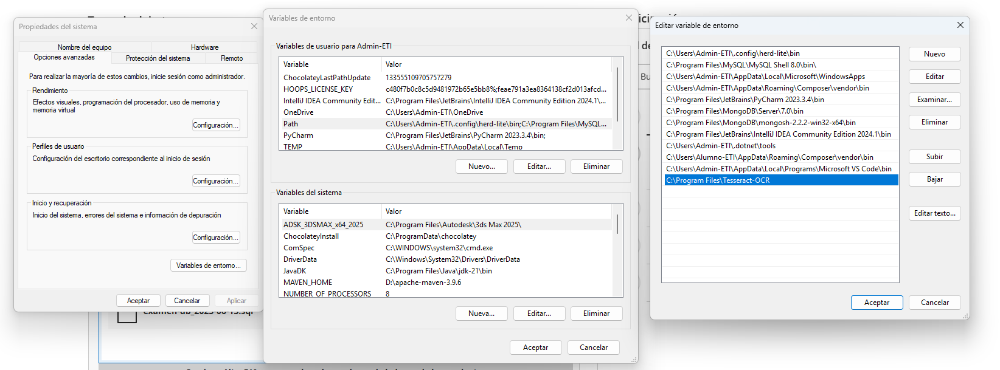

# WhatsApp Bot con Baileys + Flask

Este proyecto permite crear un bot de WhatsApp usando Node.js con la librería Baileys y un backend en Python (Flask).

## 📁 Estructura del proyecto

```
whatsapp-bot/
├── node/
│   ├── app.js
│   └── package.json
├── python/
│   └── app.py
```

## 🚀 Requisitos

- Node.js >= 18
- Python >= 3.8
- pip
- npm o pnpm

## ⚙️ Pasos para ejecutar

### 1. Instala dependencias

#### Node.js

```bash
cd node
npm install
```

#### Python

```bash
cd ../python
pip install flask
```

### 2. Importar Base de datos

- Import database (folder database)
  
### 3. Ejecuta el backend

```bash
python app.py
```

### 4. Ejecuta el bot de WhatsApp

```bash
cd ../node
node app.js
```

### 5. Escanea el QR con tu WhatsApp (normal, no Business)

- WhatsApp → Menú ⋮ → Dispositivos vinculados → Vincular dispositivo

## 🧪 Prueba

Envía un mensaje desde otro número:

- Escribe `hola`
- El bot responderá `¡Hola! ¿En qué puedo ayudarte?`

---

 
## 🧪 Tesseract
Descargar a instalar Tesseract

-  Source: https://github.com/UB-Mannheim/tesseract/wiki
-  Install: https://github.com/tesseract-ocr/tesseract/releases/download/5.5.0/tesseract-ocr-w64-setup-5.5.0.20241111.exe



